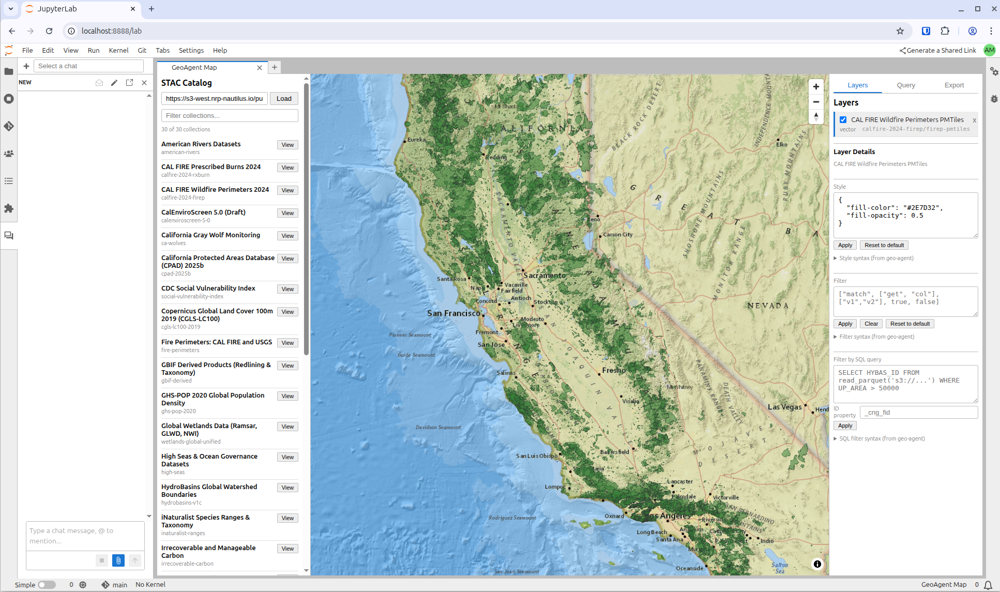

# jupyter-geoagent

A JupyterLab extension for interactive geospatial data exploration: browse STAC catalogs, add layers to a map, style and filter them, run SQL queries via MCP, and export reproducible artifacts — all without writing code.

## Where to go next

- **[Usage Guide](usage.md)** — how to use the extension day-to-day, with a quickstart and common patterns
- **[Design Specification](design.md)** — architecture, module reuse, data flow (internal reference for contributors)

## Install

### As a Python package

```bash
pip install jupyter-geoagent
```

See the project [README on GitHub](https://github.com/boettiger-lab/jupyter-geoagent) for development setup.

### As a container image (recommended for JupyterHub)

A pre-built, minimal JupyterHub single-user image ships with jupyter-geoagent plus [jupyter-ai](https://jupyter-ai.readthedocs.io/) v3 and both the Claude and OpenCode ACP personas wired up:

```
ghcr.io/boettiger-lab/jupyter-geoagent:latest
```

Everything needed for the full chat-driven workflow (GeoAgent Map panel + `@Claude` / `@OpenCode` personas + `geoagent:*` JupyterLab commands) is pre-configured — no per-pod install step. Rebuilt on every push to `main`, so `:latest` always tracks the current release. Immutable tags (`sha-<commit>`) are also published.

Built from [`docker/Dockerfile`](https://github.com/boettiger-lab/jupyter-geoagent/blob/main/docker/Dockerfile) — base image is `quay.io/jupyter/minimal-notebook`.


